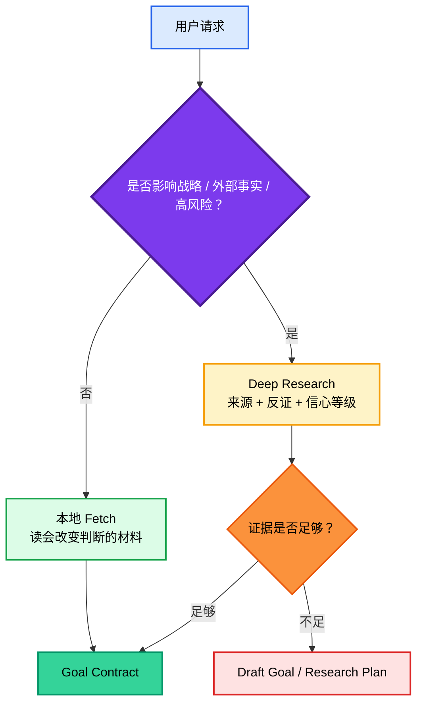
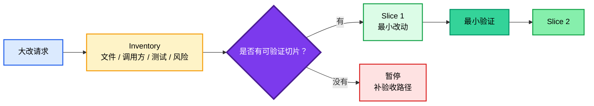

<div align="center">

<h1 style="font-size: 4em; font-weight: 900; margin-bottom: 0.1em; letter-spacing: 0.04em;">GoalPro</h1>
<p style="font-size: 1.1em; color: #2563eb; font-weight: 600; margin-top: 0;">意图放大与 Goal Contract 协议</p>

<p>
  <strong>简体中文</strong>
</p>

<p>
  
  
  
  
</p>

</div>

## 简介

**GoalPro** 是一个给 Codex 和 Claude Code 共用的 `goalpro` Skill。

它要解决的问题很直接：用户给 Agent 的任务常常是模糊的、情绪化的、战略标准不清的。模型如果直接执行，很容易过度规划、乱读上下文、先改后想、命令跑通就假装完成。

GoalPro 的作用，是先把请求变成一份可执行、可验证、可暂停的 **Goal Contract**：

- 真实意图是什么？
- 完成后局面应该发生什么变化？
- 什么算赢，什么算失败？
- 需要哪些证据、上下文和反证？
- 哪些事情本轮不做？
- 什么情况下必须暂停？
- 最后用什么证明真的完成？

> 目标不是把提示词写长，而是把 Agent 从“猜用户想要什么”拉回到“按清楚的完成契约执行”。


### 一句话总结

> 先放大真实意图，再锁定战略标准，然后写成 Agent 能执行、用户能验收的任务契约。

## GoalPro 是什么、不是什么

| 概念 | 它是什么 | 它不是什么 |
|---|---|---|
| **GoalPro Skill** | 意图放大和任务契约协议 | 简单的提示词润色器 |
| **Goal Contract** | 可执行、可验证、可暂停的目标说明 | 一串漂亮但无法验收的愿景 |
| **Deep Research 门槛** | 战略和外部事实任务的证据前置要求 | 为了显得专业而堆链接 |
| **Inventory** | 大改前的影响面、调用方、测试入口盘点 | 先重构再补解释 |
| **表达经济** | 战略完整后的删空话 | 把省字数当核心目标 |

## 快速示例

**你说：**

> 帮我写一个高质量 goal，让 Codex 修这个项目，别再跑偏。

**GoalPro 应该输出：**

```markdown
Goal:
修复项目当前阻塞问题，并交付一份能证明行为恢复的变更。

Intent:
用户真正要的不是“看起来改了代码”，而是让 Agent 先搞清失败点、影响面和验收标准，再做最小必要修复。

Strategic outcome:
项目从不可判断/不可运行状态回到可验证状态；后续继续迭代时不会靠聊天记忆猜测完成度。

Decision standard:
用户目标完成度 > 证据质量 > 最小改动 > 表达经济。不能用命令通过冒充用户目标完成。

Evidence standard:
先读错误、点名文件、README/AGENTS/CLAUDE、相关测试命令；修复后区分结构检查、本地验证和人工验收。

Execution policy:
小修直接做；跨模块或重构先输出 inventory、影响面和分片验证计划。

Stop conditions:
需要删除数据、发布、处理密钥、改公共接口，或发现多条互斥路线时暂停确认。
```

这类输出的重点不是“格式完整”，而是让执行者知道：先读什么、做什么、不做什么、什么时候停、最后拿什么证明。

## 快速开始

GoalPro 同时支持 Claude Code 和 Codex。

- `.claude/skills/goalpro/` 用于 Claude Code。
- `.agents/skills/goalpro/` 用于 Codex。

### Claude Code 个人级安装

PowerShell：

```powershell
New-Item -ItemType Directory -Force "$env:USERPROFILE\.claude\skills" | Out-Null
Copy-Item -Recurse -Force ".claude\skills\goalpro" "$env:USERPROFILE\.claude\skills\goalpro"
```

Bash：

```bash
mkdir -p ~/.claude/skills
cp -R .claude/skills/goalpro ~/.claude/skills/goalpro
```

### Codex 个人级安装

PowerShell：

```powershell
New-Item -ItemType Directory -Force "$env:USERPROFILE\.agents\skills" | Out-Null
Copy-Item -Recurse -Force ".agents\skills\goalpro" "$env:USERPROFILE\.agents\skills\goalpro"
```

Bash：

```bash
mkdir -p ~/.agents/skills
cp -R .agents/skills/goalpro ~/.agents/skills/goalpro
```

### 项目级安装

把对应目录复制到目标项目：

```text
目标项目/
├── .claude/skills/goalpro/   # Claude Code
└── .agents/skills/goalpro/   # Codex
```

## Skill 名称与触发

Skill 名称是 `goalpro`。

这里不用 `goal`，是为了避免和用户口头说的 goal、Goal Contract 字段，以及 slash command 语义产生混淆。Claude Code 中 Skill 可通过 `/skill-name` 调用，因此本 Skill 的直接入口是 `/goalpro`；`/goal` 不是本项目 Skill 名。

常见触发方式：

- `写一个高质量 goal`
- `帮我优化这个任务提示词`
- `把这个需求变成可执行的 Goal Contract`
- `给 Claude Code 写执行任务`
- `明确 done when / success criteria`
- `先 deep research 再定战略`
- `这个计划跑偏了，重写 goal`
- `大改前先给 inventory 和验证计划`

## 使用路径

| 任务 | 方法重点 | 输出 |
|---|---|---|
| **模糊需求** | 放大真实意图、定义成败标准 | Goal Contract |
| **战略任务** | Deep Research、证据地图、反证 | Research-backed Goal Contract |
| **代码执行** | 先读上下文、分片执行、验证 | Codex 执行提示词或 Claude Code 任务 |
| **大改/重构** | Inventory、影响面、测试入口 | 分片计划和暂停条件 |
| **修复跑偏** | 找旧目标错位点、重写边界 | 修正版 Goal Contract |
| **验收收尾** | 区分结构检查、本地验证、人工验收 | 最终报告标准 |

---

## 联系方式


GitHub <a href="https://github.com/KimYx0207">KimYx0207</a> |
X <a href="https://x.com/KimYx0207">@KimYx0207</a> |
官网 <a href="https://www.aiking.dev/">aiking.dev</a> |
微信公众号：<strong>老金带你玩AI</strong>

飞书知识库：
<a href="https://my.feishu.cn/wiki/OhQ8wqntFihcI1kWVDlcNdpznFf">长期更新入口</a>

### 请老金喝杯咖啡

如果 GoalPro 对你有帮助，欢迎请我喝杯咖啡，算是对持续维护的支持。

<table align="center">
<tr><th>微信支付</th><th>支付宝</th></tr>
<tr>
<td align="center"></td>
<td align="center"></td>
</tr>
</table>

---

## 方法架构

GoalPro 的核心不是固定模板，而是一条意图到交付的主干。

```text
Critical -> Fetch -> Thinking -> Inventory -> Contract -> Review -> Verification
```

### 主干

| 阶段 | 要解决的问题 | 不通过时的处理 |
|---|---|---|
| **Critical** | 用户真正要改变什么？ | 回到意图，不直接执行表面请求 |
| **Fetch** | 哪些材料会改变判断？ | 先读本地上下文或外部来源 |
| **Thinking** | 哪条路线最能赢？ | 比较取舍，标出反证和未知 |
| **Inventory** | 影响面和验证入口是什么？ | 大改前暂停，先盘点 |
| **Contract** | 如何写成执行契约？ | 补齐目标、边界、暂停条件 |
| **Review** | 有没有空话、越界、假完成？ | 删掉装饰性流程，保留判断 |
| **Verification** | 用什么证明完成？ | 区分未验证、结构检查、本地验证、人工验收 |

### Deep Research 门

战略、外部事实、高风险任务不能直接给最终 Goal。



### Evidence Map

战略任务必须形成证据地图，而不是只贴链接：

```markdown
Evidence Map:
- Source:
  Source type:
  Claim:
  Relevance:
  Confidence:
  Counterevidence:
  Decision impact:
```

### Inventory 门

大改、重构、跨模块任务必须先盘点：



## Goal Contract 字段

| 字段 | 作用 | 常见错误 |
|---|---|---|
| `Goal` | 一句话说明任务对象、动作和方向 | 写成愿景 |
| `Intent` | 放大后的真实意图 | 复述用户原话 |
| `Strategic outcome` | 完成后局面发生什么变化 | 只写交付物 |
| `Decision standard` | 路线判断、优先级、失败条件 | “高质量”但不可判 |
| `Evidence standard` | 来源、验证、反证、信心等级 | 搜到资料就算完成 |
| `Scope` | 本轮包含什么 | 塞未来计划 |
| `Non-goals` | 本轮不做什么 | 写“无”但任务很宽 |
| `Context to read first` | 先读哪些会改变判断的材料 | 全仓库漫游 |
| `Constraints` | 权限、安全、兼容、语言等硬限制 | 写成建议 |
| `Execution policy` | 直接做、先问、先 inventory 的规则 | 仪式化提问 |
| `Checkpoints` | 推进节点和可检查产物 | 过程流水账 |
| `Verification` | 完成证据 | 命令通过 = 完成 |
| `Stop conditions` | 必须暂停的条件 | 风险出现还继续 |
| `Final report` | 最后汇报形状 | 大段复述过程 |

## 设计原则

| 原则 | 原因 |
|---|---|
| 意图完成度优先 | 任务真正完成，比提示词漂亮更重要 |
| 证据先于战略 | 没有 Fetch 的战略只能是草案 |
| 上下文按需读取 | 全仓库漫游会制造噪音和误判 |
| 大改先 inventory | 先知道影响面，才能控制重构风险 |
| 社区信号要交叉验证 | GitHub、X、Reddit 能暴露失败模式，但不能替代证据 |
| 表达经济从属 | 只删空话，不删判断、边界、证据和验收 |
| 验证分层 | 结构检查、本地验证、线上验证、人工验收不是一回事 |
| 不增加装饰机制 | agent、hook、eval 只有能防真实失败时才加 |

---

## 文件结构

```text
README.md                         # 中文项目页
docs/images/                      # 联系二维码和收款码
.agents/skills/goalpro/           # Codex 使用的 goalpro Skill
├── SKILL.md
└── references/
    ├── examples.md
    └── source-rules.md
.claude/skills/goalpro/           # Claude Code 使用的 goalpro Skill
├── SKILL.md
└── references/
    ├── examples.md
    └── source-rules.md
```

不提交的本机产物：

- `.codex/`
- `.meta-kim/`
- `graphify-out/`
- Python / Node 缓存、虚拟环境、构建输出、`.env`

---

## 参与贡献

如果你发现 Goal Contract 字段不够清楚、示例不够贴近真实任务，或者某条规则会导致 Agent 过度规划，可以开 Issue 或提交 PR。

贡献时请保持三条边界：

1. 不把缩短提示词当核心目标。
2. 不为了完整感增加机制。
3. 不把未经验证的社区观点写成标准。

---

## 延伸阅读

- [Codex goalpro Skill](.agents/skills/goalpro/SKILL.md)
- [Claude Code goalpro Skill](.claude/skills/goalpro/SKILL.md)
- [方法依据](.agents/skills/goalpro/references/source-rules.md)
- [示例校准](.agents/skills/goalpro/references/examples.md)
